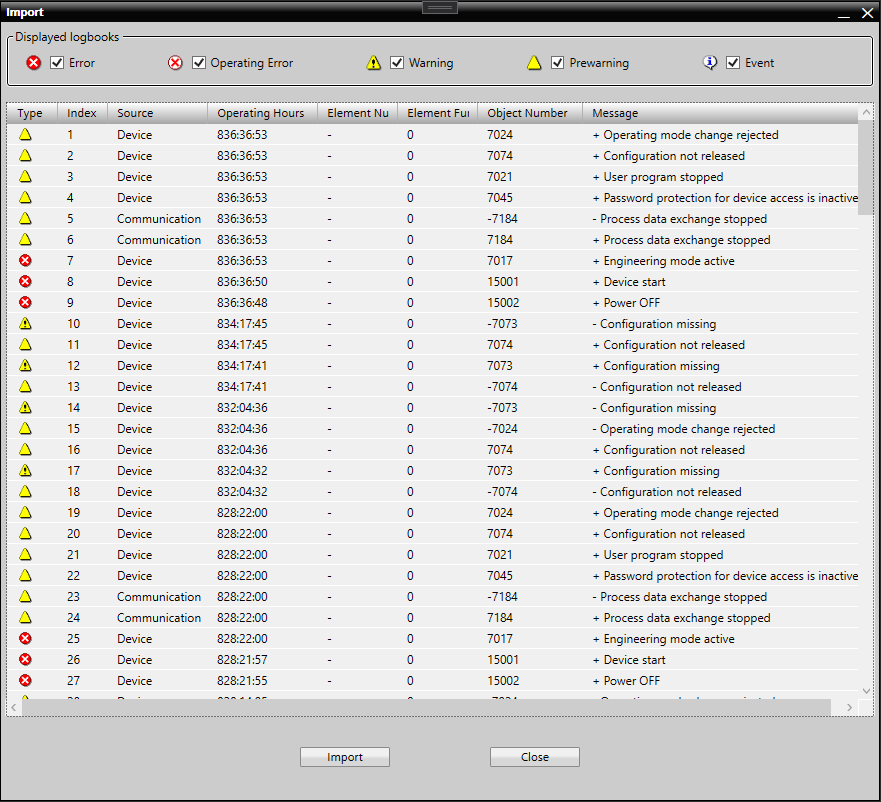

# Logbook Viewer

This is a TIA AddIn that helps display exported logbook entries with filtering and sorting capabilities.

## Installing

*  Download the addin file from the Releases page & place it on the "AddIns" folder under your TIA Portal installation directory.

## Debugging & Development

*  Adjust the "PostBuild.cmd" file according to your TIA Portal installation & build the Sirius.LogbookViewer project. This will place the .addin output file on the TIA Portal - AddIns folder automatically.